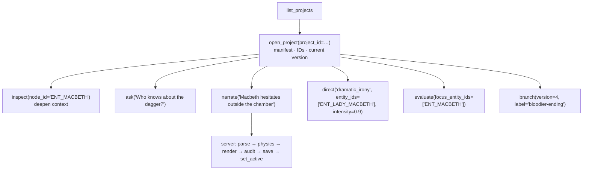

# MCP Guide — `shadow_loom_mcp`

Shadow-Loom ships a [Model Context Protocol](https://modelcontextprotocol.io)
server that exposes the entire causal narrative engine — ingestion, simulation,
generation, audit, version management — as **42 tools and 5 resources** that any
MCP-aware agent (Claude Desktop, Cursor, Continue, custom clients) can drive
directly.

The server is implemented on top of [FastMCP](https://github.com/jlowin/fastmcp)
and lives in [`shadow_loom_mcp/server.py`](../shadow_loom_mcp/server.py).

---

## 1. Quick start

```bash
conda activate shadow-loom
pip install -e .

# Run the server (stdio transport, FastMCP default)
python -m shadow_loom_mcp

# Run over HTTP (required for Bearer-token auth to take effect)
MCP_TRANSPORT=http MCP_PORT=8000 python -m shadow_loom_mcp
```

> **Transport vs. auth.** The Bearer-token scheme in §2 only runs over an
> HTTP transport, because stdio has no HTTP `Authorization` header. Under
> the default **stdio** transport `access_token` is always `None`, so every
> authenticated tool fails closed unless `MCP_ALLOW_OPEN_MODE=true` (trusted
> local use, e.g. Claude Desktop). For any networked / multi-user
> deployment set `MCP_TRANSPORT=http` so the token verifier actually runs.

The server reads its configuration from `.env` /
[`shadow_loom/settings.py`](../shadow_loom/settings.py). Key settings:

| Env var | Purpose |
|---|---|
| `DATABASE_URL` | SQLite / Postgres URL backing the version store. |
| `MCP_TRANSPORT` | `stdio` (default, local/Claude Desktop) or `http` (networked; required for Bearer auth). Honours `MCP_HOST` / `MCP_PORT`. |
| `MCP_ALLOW_OPEN_MODE` | If `true`, falls back to the most-recently-cached token when a request arrives without an active context (dev/test only — fail-open). Default `false`. |
| `MCP_SKIP_AUDIT` | Default value of the `skip_audit` flag on `narrate` / `direct`. |
| `MCP_INGEST_FABULA_TIME_SPACING` | Spacing for fabula ticks during `ingest` (default 1000). |
| `MCP_INGEST_MAX_CORRECTION_RETRIES` | Programmatic-validation correction retries during `ingest`. |

### Connecting from Claude Desktop / Cursor

```json
{
  "mcpServers": {
    "shadow-loom": {
      "command": "python",
      "args": ["-m", "shadow_loom_mcp"],
      "env": {
        "DATABASE_URL": "sqlite:///shadow_loom.db"
      }
    }
  }
}
```

---

## 2. Authentication & scopes

All requests carry a **bearer token** that maps to an `ApiKeyRow` in the
database. See [`shadow_loom_mcp/auth.py`](../shadow_loom_mcp/auth.py).

* Bearer token → cached `{user_id, scopes, key_id}` on first validation.
* Tools enforce one of three scopes:

| Scope | Tool groups |
|---|---|
| `read` | ORIENT + EXPLORE + REASON + JUDGE + `get_active_version` |
| `write` | CREATE + most MANAGE (branch, fork, delete, promote_branch, `set_active_version`, …) |
| `admin` | `share`, `update_project_tool` |

Resources (`world://…`) skip scope checks — they are intended for read-only
context priming. Every tool also checks **per-project membership** via
`check_project_access(...)` so a `read`-scoped key cannot read another user's
private project.

**Per-project role enforcement.** `check_project_access(project_id, ctx, *, min_role=…)`
takes a `min_role` discriminator (`"viewer" < "editor" < "admin"`) so
mutating tools require a project-level role above bare membership. The
project owner always passes; public projects only grant `viewer`-level
access. Current call sites:

| `min_role` | Tools |
|---|---|
| `viewer` (default) | All read paths, `fork` (creates new project under caller) |
| `editor` | `set_project_settings`, `branch`, `delete_version`, `reparent_version`, `set_active_version` (per-user pointer; round-7 audit promoted from read+viewer because it mutates per-user routing) |
| `admin` | `share`, `delete_project` |

A scoped-but-under-roled call returns `{"error": "min_role=admin required …"}`
instead of executing.

The fail-closed default means a tool returns `{"error": "missing scope: write"}`
rather than executing if the bearer token is unknown or under-scoped.

**Key rotation.** `db.revoke_api_key(...)` flips `is_active=False` *and*
calls `auth.invalidate_token_cache(key_id=...)` so the in-process token
cache stops resolving the revoked key on the next request — without
that call a revoked key would remain usable for the lifetime of the
server process. Programmatic callers that mark keys inactive directly
(bypassing `revoke_api_key`) should call `invalidate_token_cache`
themselves.

---

## 3. The 42 tools, by cognitive task

### Coarse-grained dispatchers — prefer these for new integrations

Four action-discriminated tools wrap the granular surface so callers
can reach most functionality through one well-known entry point. The
underlying granular tools (listed in the sections below) remain
registered for backward compatibility but are slated for removal once
clients have migrated.

**Why coarse-grained?** Each dispatcher takes a small set of
discriminator + `payload` arguments instead of forcing the caller to
remember 13 separately-named admin tools. LLM clients pick an action
from a short enum and drop kind-specific arguments into `payload`.

| Tool | Replaces | Discriminator |
|---|---|---|
| `discover(scope, project_id?, payload?)` | `list_projects`, `list_branches`, `list_channels`, `list_world_facts` (+ proposition/concern/superseded-event surfaces) | `scope ∈ {projects, branches, channels, world_facts, propositions, concerns, superseded_events}` |
| `trace(kind, project_id?, payload)` | `trace_causality`, `get_history`, `get_channel_history` | `kind ∈ {causal, history, channel}` |
| `author(action, project_id?, payload)` *(async)* | `ingest`, `write`, `research_topic`, `delete_world_fact` | `action ∈ {ingest, edit, research, forget_fact}` |
| `manage(action, project_id?, payload)` | `branch`, `fork`, `share`, `promote_branch`, `update_project_tool`, `delete_project`, `delete_version`, `reparent_version`, `set_active_version`, `get_active_version`, `set_project_settings`, `get_project_settings`, `get_research_status`, `export_prose` | 14 actions — see below |

#### `discover(scope, project_id?, payload?)` — what's available

| `scope` | `project_id` | `payload` keys | Returns |
|---|---|---|---|
| `"projects"` | — | — | `{projects: [...]}` |
| `"branches"` | required | — | `{branches: [...]}` |
| `"channels"` | required | `version` (optional) | `{channels: [...]}` |
| `"world_facts"` | required | — | `{project_id, facts: [...], count}` |
| `"propositions"` | required | `version`, `at_time` (fold each through `reconstruct_proposition_at`) | `{propositions: [...], count}` |
| `"concerns"` | required | `version`, `at_time` (replay), `entity_id` (filter), `only_active` (drop concerns inactive at `at_time`) | `{concerns: [...], count}` |
| `"superseded_events"` | required | `version` | `{superseded_events: [...], count}` — each with its `successor_chain` |

```jsonc
discover(scope="projects")
discover(scope="channels", project_id=42, payload={"version": 3})
discover(scope="world_facts", project_id=42)
discover(scope="propositions", project_id=42, payload={"at_time": 12000})
discover(scope="concerns", project_id=42, payload={"entity_id": "ENT_MACBETH", "at_time": 12000, "only_active": true})
discover(scope="superseded_events", project_id=42)
```

#### `trace(kind, ...)` — follow a chain

| `kind` | `payload` keys | Returns |
|---|---|---|
| `"causal"` | `node_id` *(req)*, `version`, `direction ∈ {upstream, downstream, both}`, `depth` (default 3), `include_information_flow` (default `true`) | `{root, direction, depth, nodes, edges, information_flow?}` |
| `"history"` | `version` (omit for full tree) | full tree → `{project_id, versions}`; single → `{version, source, prose, changeset, …}` |
| `"channel"` | `channel_id` *(req)*, `version` | `{channel, utterances: [...]}` |

```jsonc
trace(kind="causal", project_id=42, payload={"node_id": "EVT_DUNCAN_DEATH", "depth": 4})
trace(kind="history", project_id=42)
trace(kind="channel", project_id=42, payload={"channel_id": "CHN_LETTERS"})
```

#### `author(action, ...)` *(async)* — mutate world data

| `action` | `payload` keys | Notes |
|---|---|---|
| `"ingest"` | `text` *(req)*, `label` | Project name comes from `project_name`. Emits progress notifications. |
| `"edit"` | `prose` *(req)*, `description`, `version` | Manual edit — re-extracts topology, creates a new version, skips audit. |
| `"research"` | `topic` *(req)*, `provider`, `max_results` | Provider call + agent distil + persist a `WorldFact`. |
| `"forget_fact"` | `fact_id` *(req)* | Delete a `WorldFact` by id. |

```jsonc
author(action="ingest",        project_name="Macbeth", payload={"text": "..."})
author(action="edit",          project_id=42, payload={"prose": "...", "description": "Act II revision"})
author(action="research",      project_id=42, payload={"topic": "Roaring Twenties speakeasies"})
author(action="forget_fact",   project_id=42, payload={"fact_id": "FACT_003"})
```

#### `manage(action, ...)` — admin / config

| `action` | Scope | `payload` keys |
|---|---|---|
| `"branch"` | write | `from_version` *(req)* |
| `"fork"` | write | `new_name` *(req)* |
| `"share"` | admin | `username` *(req — exact match)*, `role ∈ {viewer, editor, admin}` |
| `"promote_branch"` | write | `version_row_id` *(req)*, `description` — source row must belong to `project_id` (cross-project promote denied) |
| `"update_project"` | admin | any of `name`, `description`, `is_public` |
| `"delete_project"` | write | — |
| `"delete_version"` | write | `version_row_id` *(req)*, `cascade` |
| `"reparent_version"` | write | `version_row_id` *(req)*, `new_ancestor_id` |
| `"set_active_version"` | write | `version_row_id` *or* `version` (sequential, project-scoped). Omit both to clear the pointer. Requires the `editor` role on the project (round-7 audit). |
| `"get_active_version"` | read | — |
| `"get_settings"` | read | — |
| `"set_settings"` | write | `research_topics: list[str]` *(req)* |
| `"research_status"` | read | — *(no `project_id` required)* |
| `"export_prose"` | read | `branch_path` (optional list of `version_row_id`s) |

```jsonc
manage(action="branch",          project_id=42, payload={"from_version": 7})
manage(action="share",           project_id=42, payload={"username": "alice", "role": "editor"})
manage(action="set_settings",    project_id=42, payload={"research_topics": ["Edinburgh 1606"]})
manage(action="research_status")  // no project_id — process-wide status
```

All dispatchers return `{"error": "..."}` for missing or unknown
discriminators / payload fields. Successful responses are passed
through verbatim from the underlying granular tool, so existing
integrations can migrate one call at a time.

### ORIENT — "What stories exist? What's in this one?"

> **Note:** `list_projects` is wrapped by [`discover(scope="projects")`](#discoverscope-project_id-payload--whats-available). New integrations should use the dispatcher.

| Tool | Scope | Purpose |
|---|---|---|
| `list_projects` | read | List every project the user can access. |
| `open_project` | read | Returns a full **manifest**: entity/location/object/event/world-trait IDs with names, topology counts (including `channels` and `utterance_events`), `current_version` (the version actually loaded — honours the active-version pointer or an explicit `version=`) and `latest_version` (the project tip). **Always call this first.** |

### EXPLORE — "Tell me about this character / event / place / channel."

> **Note:** `list_channels`, `get_channel_history`, `trace_causality`, `get_history`, `list_branches`, `export_prose` are all wrapped by `discover` / `trace` / `manage`. The granular tools below remain for backward compatibility.

| Tool | Scope | Purpose |
|---|---|---|
| `inspect(node_id, at_time=None)` | read | Auto-routes by ID prefix (`ENT_`, `LOC_`, `EVT_`, `OBJ_`, `CHN_`, `WORLD_`). Pass `at_time` to time-slice an entity / world trait via `reconstruct_entity_at`. |
| `search(query, kinds=…)` | read | Fuzzy + substring search across nodes. |
| `get_relationships(entity_id)` | read | Affinity / fear / power / inertia table for an entity. |
| `list_channels(entity_id=None, medium=None)` | read | Enumerate `Channel` nodes with participants, intelligibility map, medium, and per-channel utterance count. |
| `get_channel_history(channel_id)` | read | Ordered list of `utterance` events on a channel, with speaker / addressees / `truth_value` / `content`. |
| `who_can_hear(speaker_id, at_time=None)` | read | Resolves the audience reachable from a speaker via current channels, weighted by per-recipient intelligibility. |
| `trace_causality(node_id, …)` | read | Walks `causal_topology` ancestors and descendants up to a depth. |
| `get_history(node_id)` | read | Timeline of state changes for an entity or world trait. |
| `list_branches()` | read | Walks the version DAG and returns one summary per branch (`world_id` `factual` / `shadow`, `branch_label`, root + head version, fork-point ancestor, version count). |
| `export_prose(branch_path=None)` | read | Returns prose across versions — either implicit linear order, or a specific lineage when `branch_path` (a list of `version_row_id`s) is supplied. |

### REASON — "Answer questions, run what-ifs without writing prose."

| Tool | Scope | Purpose |
|---|---|---|
| `ask(question)` | read | Routes through `parse_query` → `InterrogationQuery`. After `calculate_narrative_physics` runs, the tool dispatches `shadow_loom.answer.answer_question` to render an `AnswerCard{answer, confidence, caveats, evidence_node_ids}`; the response object surfaces those four fields directly alongside the underlying physics state. No prose, no version write. |
| `compute_tension(vector_id, …)` | read | Runs the affective scorers (mystery / irony / suspense / surprise) over the current graph for a given POV. |
| `diff_versions(v_a, v_b)` | read | Structured changeset between two versions. |

### CREATE — "Advance the story."

> **Note:** `write` and `ingest` are wrapped by `author(action="edit")` / `author(action="ingest")`. `narrate` and `direct` remain top-level tools — they map directly to a single caller intent and need no consolidation.

| Tool | Scope | Notes |
|---|---|---|
| `narrate(instruction, mode=None, skip_audit, force_implausible, speaker_id=None, addressee_ids=None, via_channel_id=None)` | write | The main creation entry point. NL → `parse_query` → `run_pipeline` → version write → active pointer advance. `mode` can pin the query type to `observe` / `intervene` / `counterfactual` / `directive` (validated strictly against this set; unknown modes return `{error, code: "INVALID_MODE"}`). The `speaker_id` / `addressee_ids` / `via_channel_id` hints constrain the parser to emit a properly-typed `utterance` event with channel provenance. The parser also extracts optional **story-point anchors** (`temporal_anchor` / `syuzhet_anchor` / `anchor_after_event_id`) from the user's NL request so phrases like "after EVT_BANQUO_DEATH" or "in act 3" pin the query to the right slice without the caller looking the time up. |
| `direct(target_effect, entity_ids=…, intensity=0.8, temporal_anchor=None, syuzhet_anchor=None, anchor_after_event_id=None, …)` | write | Builds a `DirectiveQuery` directly (no NL parse) and runs the affective optimisation pipeline. The optional anchor arguments override `PipelineConfig.temporal_anchor` / `syuzhet_anchor` for a single call. |
| `write(prose, description="")` | write | Manual edit — supplies user prose, runs prose → topology re-extraction, merges into a new version (skips physics + LLM rendering). |
| `ingest(text, project_name, label=None)` | write | Creates a brand new project and runs the 5-step ingestion to produce v0. If the v0 save fails the freshly-created project row is rolled back so failed ingests do not leave orphan projects with zero versions. |
| `patch_world_state(patch, project_id=None, project_name=None, version=None, description="")` | write | Applies a structured `WorldStatePatch` dict directly to the world model, bypassing the prose re-extraction round-trip when the change is already known structurally (e.g. backfilling `Belief.proposition_id`, committing a proposition truth, renaming a channel, dropping/adding causal/social/spatial edges, fixing a miswired event field). Loads via `load_world_state_with_branch` so branch identity is preserved, then creates a new version on success. Returns `{new_version, changes: [...]}` or `{error}` if the patch fails to validate or apply. |

`narrate`, `direct`, and `ingest` emit FastMCP `progress_notifications` so an
MCP client can show a progress bar.

**Concurrency.** `narrate` and `direct` are `async` tools, but the
underlying pipeline (`run_and_save`) is synchronous and CPU-/LLM-bound
for several seconds per call. Both tools dispatch the pipeline through
`asyncio.to_thread(...)` so the FastMCP event loop continues serving
other tools (e.g. `discover`, `trace`, progress polling) while a
generation is in flight. If you implement an additional async tool
that wraps a synchronous pipeline call, follow the same pattern \u2014
calling `run_and_save` directly from an `async def` blocks every
concurrent request.

### JUDGE — "How good is this story?"

| Tool | Scope | Purpose |
|---|---|---|
| `evaluate(focus_entity_ids=…)` | read | Runs the full `EvaluationQuery` — collects all prose across versions, recomputes engine metrics, returns the `NarrativeOrderObject` scorecard. |
| `audit_log(version=None)` | read | Returns the auditor's structured

> **Note:** `research_topic`, `list_world_facts`, `delete_world_fact` are wrapped by `author(action="research")` / `discover(scope="world_facts")` / `author(action="forget_fact")`. `get_research_status` and `get_project_settings` / `set_project_settings` are wrapped by `manage(action="research_status" | "get_settings" | "set_settings")`. loss for a given version. |

### RESEARCH — "Look up real-world background on a topic." (optional)

These tools are no-ops unless the operator has installed the optional
`[research]` extra (`pip install -e ".[research]"`) and configured a
provider. They never mutate `Entity` / `EventNode` / `RelationshipEdge`
/ `GlobalTrait` namespaces — results land only in
`WorldStateV1.world_facts`. Provider calls are cached **per-account**
so one user's lookups are never reused for another.

| Tool | Scope | Purpose |
|---|---|---|
| `research_topic(topic, provider=None, max_results=None)` | write | Calls the configured provider (default Tavily) for `topic`, distils the snippets through the `research_extraction` agent and persists a `WorldFact` against the project. Returns `{fact_id, summary, confidence, source_url_primary, related_node_ids, snippet_count, cached}`. |
| `list_world_facts()` | read | Enumerate every `WorldFact` attached to the project. |
| `delete_world_fact(fact_id)` | write | Remove a fact. The next version saved will exclude it from `WorldStateV1.world_facts`. |
| `get_research_status()` | read | Process-wide status: provider, enabled flag, API-key presence (boolean — never the key), default topics. Used by the UI Research tab to gate the run-now buttons. |
| `get_project_settings()` | read | Per-project settings — currently `research_topics: list[str]`. Settings live outside `WorldStateV1` so they never fork with shadow branches and never bloat version snapshots. |
| `set_project_settings(research_topics)` | write | Replace the project's `research_topics` list. Topics are stripped + de-duplicated. Pass `[]` to clear. Editing settings does not mutate any version. |

See the research section of
[docs/architecture.md](architecture.md#step-3d--optional-external-research-segregated-off-by-default) for
the segregation contract and [CONTENT-POLICY.md §6.4a](../CONTENT-POLICY.md)
for the user-facing guarantees.

> **Note:** Every tool in this section is wrapped by `manage(action=...)`. New integrations should use the dispatcher; the granular tools remain for backward compatibility.

### MANAGE — "Edit the metadata, branch, fork, share, delete."

| Tool | Scope |
|---|---|
| `branch`, `fork`, `share` | write / write / admin |
| `update_project_tool` | admin |
| `delete_project`, `delete_version`, `reparent_version` | write |
| `promote_branch(version_row_id)` | write |
| `set_active_version`, `get_active_version` | write / read |

`set_active_version` updates the per-user `ActiveVersionRow` pointer, so every
subsequent `narrate` / `inspect` / etc. resolves against that version unless
overridden by an explicit `version=` argument. The same pointer is read by
the NiceGUI workspace, so an agent and a human author always converge on the
same branch tip.

`promote_branch` copies a shadow-branch version onto a new factual `VersionRow`
so the chosen counterfactual becomes canon while the shadow source stays
browsable for diffing.

### Branch-aware reads and writes (AMWN node-splitting)

When the resolved version row sits on a shadow branch, every **read**
tool (`inspect`, `search`, `get_relationships`, `list_channels`,
`get_history`, `ask`, …) automatically loads the world state through
`WorldStateV1.projected_for_branch(branch_world_id, branch_label)`
via the internal `helpers.load_world_state_projected` helper, so the
returned snapshot reflects the AMWN-split clones on that branch
rather than the factual baseline. Factual rows return `self` and
incur zero overhead.

Every **write** tool that persists a new version
(`patch_world_state`, `branch`, `run_and_save`, …) carries the
ancestor row's `(world_id, branch_label)` into `save_version` via
`helpers.load_world_state_with_branch`, so a structured patch
applied to a shadow row stays on that shadow branch rather than
silently demoting onto the factual mainline (which the prior
`save_version` default of `world_id="factual"` used to do).
Agents that want to fork a new shadow branch off the current row
call `manage(action="branch", ...)` explicitly; agents that want
to keep editing within the current branch can call
`patch_world_state` and trust the branch identity is preserved.

---

## 4. The 5 resources

```
world://projects                                 # list of projects + summaries
world://project/{project_id}                     # project metadata + version list
world://project/{project_id}/world               # full WorldStateV1 JSON
world://project/{project_id}/entity/{entity_id}  # one entity (with timeline)
world://project/{project_id}/versions            # version tree (ancestry)
```

Resources are designed for **context priming** — point your agent at
`world://project/{id}/world` once at the start of a conversation and it has
the full graph in scope without burning a tool call per inspection.

### Resource payload caps (thirteenth-pass audit, 2026-05-29)

Large projects can produce gigantic resource payloads that exceed the MCP
client's framing budget and silently truncate mid-JSON. To make the limits
explicit and recoverable, the four "sibling" resources cap their bodies and
return a **summary projection** plus a `truncated` envelope when over the
cap:

| Resource | Byte cap | Row cap | Fallback when exceeded |
|---|---|---|---|
| `world://project/{id}/world` | 1 MB | — | `_summary_projection(ws)` (counts only). |
| `world://project/{id}/entity/{entity_id}` | 250 KB | — | `{id, name, status, belief_count, concern_count, state_timeline_count}`. |
| `world://project/{id}/versions` | 500 KB | 1 000 rows | Row-cap first, then byte-cap. Truncated payloads are wrapped in `{"truncated": true, "limit": N, "rows": [...]}`. |

Clients that need the full body should fall back to the equivalent **tool**
call (`get_world_state`, `get_entity`, `list_versions`) which streams
rather than packs into one resource frame.

---

## 5. The auto-versioning contract

Every write tool funnels through
[`shadow_loom_mcp/helpers.py::run_and_save`](../shadow_loom_mcp/helpers.py):

1. Resolve the **ancestor** (`ancestor_row_id`) — either the user's active
   version or an explicit `version=` argument.
2. Run `run_pipeline(query, versioned_model=...)`.
3. If `result.implausible` → return the explanation, **do not write a version**.
4. If `result.reextraction_failed` → return the prose with a warning, **do not
   write a version** (prose and world model are out of sync).
5. If the merged world model is byte-identical to the ancestor (for example a
   `direct` call that produced no graph change) → return the prose with a
   `world_model_unchanged` / `version_skipped` flag, **do not write a version**.
6. Otherwise `save_version(...)` with `ancestor_id = ancestor_row_id` and call
   `set_active_version(...)` so the user's pointer follows the new tip.

The response always includes `version`, `ancestor_id`, `prose`,
`physics_state`, the auditor verdict, **and a `branch` envelope**
(`{world_id, branch_label, ancestor_id}`) so the agent can tell whether the
new version landed on factual mainline or on a shadow fork — enough for the
agent to decide what to do next without re-querying.

---

## 6. Typical agent workflow



---

## 7. Error surface

Every tool is wrapped in `_safe_tool`, which catches unhandled exceptions and
routes them through `_sanitised_error` so callers receive a typed envelope
rather than raw exception text. Common error shapes:

```json
{ "error": "missing scope: write" }
{ "error": "Project 7 not accessible by user 3" }
{ "error": "Query parsing failed",
  "reasoning": "...", "validation_errors": [{"field":"interventions","message":"..."}] }
{ "error": "unknown narrate mode 'consider'; expected one of ['counterfactual','directive','intervene','observe']",
  "code": "INVALID_MODE" }
{ "implausible": true,
  "implausibility_reason": "Rung-2 intervention is impossible: ...",
  "implausibility_details": {"unresolved_targets": [...]} }
```

The `implausible` envelope is **not** an error — the request was understood but
the engine refused to mutate the world. Callers should surface the reason and
optionally retry with `force_implausible=true`.

**Post-audit (2026-05-26) hardening:**

* Provider stack traces, filesystem paths, and raw SDK payloads never
  reach the wire — `_sanitised_error` reduces them to a generic
  `internal_error` envelope; the full trace is captured in the server
  log only.
* `manage(action="fork")` accepts the same defaulted `new_name`
  (`"<project> (fork)"`) as the granular `fork` tool.
* `narrate(mode=…)` validates `mode` strictly; the previous silent
  fallback to `directive` is gone.
* `set_active_version` requires the `editor` role on both the
  granular tool and `manage(action="set_active_version")`.
* `list_projects(user_id=None)` returns only public / example
  projects to unauthenticated callers.
* API keys are stored as HMAC-SHA-256 over per-key salt + server
  pepper (`SHADOW_LOOM_API_KEY_PEPPER`); the `key_hash` column is
  indexed.

---

## 8. Tests

`tests/test_mcp_server.py` exercises every tool against an in-memory SQLite DB
with a mocked Context. The fail-closed auth path, the per-project membership
check, the `run_and_save` versioning contract, and the implausibility envelope
all have dedicated test cases.

```bash
python -m pytest tests/test_mcp_server.py -q
```

---

## See also

* [rest-api.md](rest-api.md) — the `shadow_loom_rest` FastAPI adapter that exposes these same 42 tools over plain HTTP/JSON, reusing the same tool bodies and API keys.
* [pipeline-walkthrough.md](pipeline-walkthrough.md) — what happens **inside** a `narrate` / `direct` / `write` / `ingest` call once `run_and_save` invokes the pipeline.
* [query-and-cycles.md](query-and-cycles.md) — the eight typed queries `narrate` parses NL into, and the per-type cycle each runs.
* [architecture.md §10](architecture.md) — the conceptual summary of the MCP surface plus links into the rest of the engine.
* [ui-guide.md](ui-guide.md) — the human-facing equivalent of the same tools, useful when debugging an agent's session against your own eyes.
* [design-decisions.md](design-decisions.md) — *why* every write goes through the implausibility / re-extraction gate before persisting a version.
