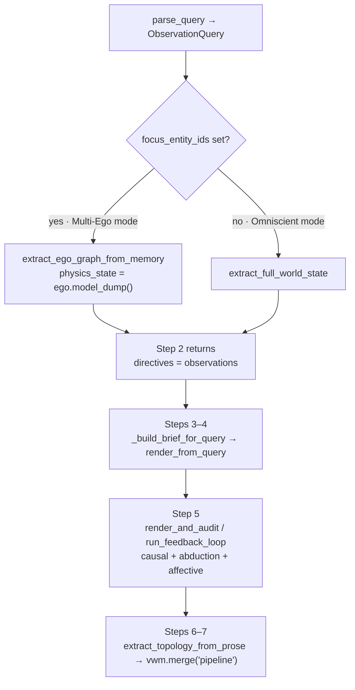
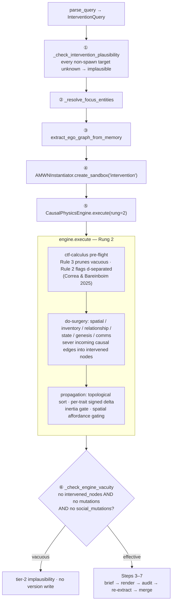
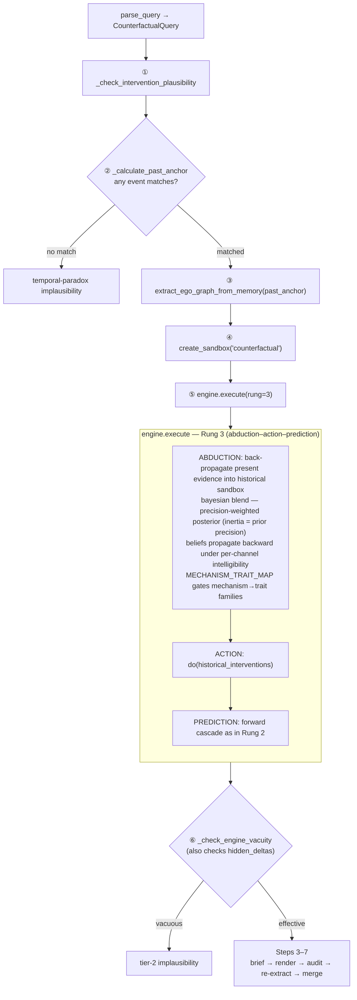
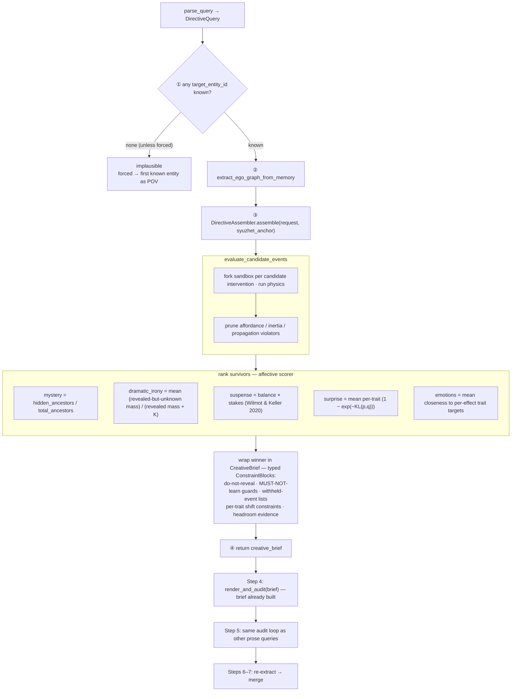
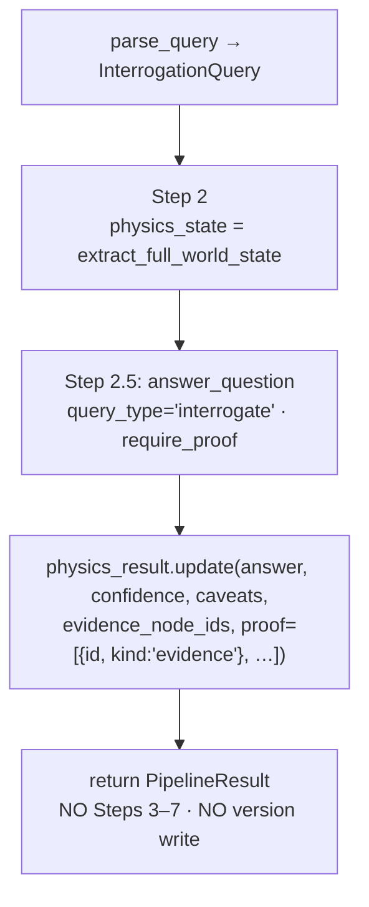
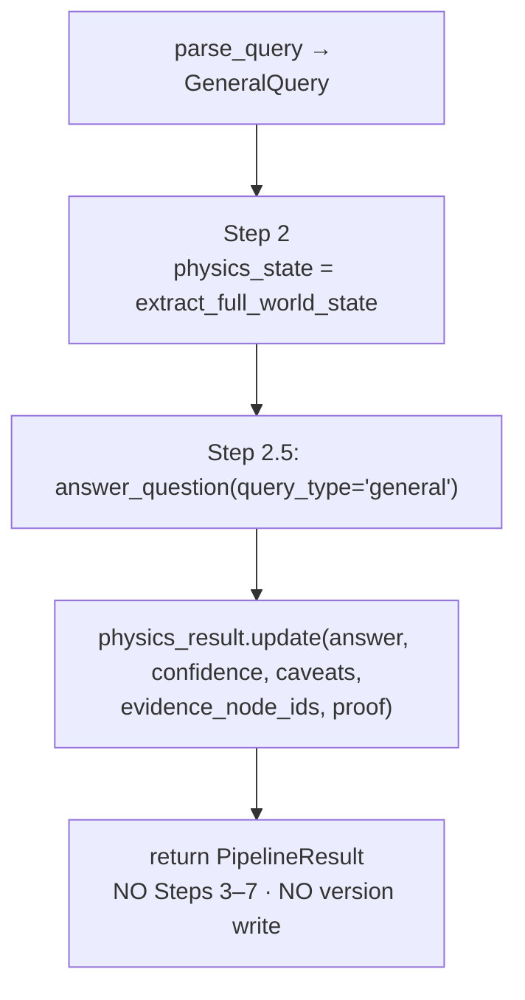
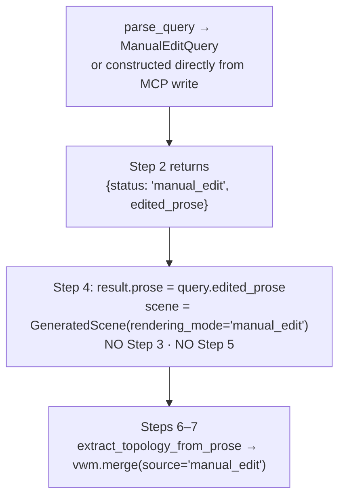
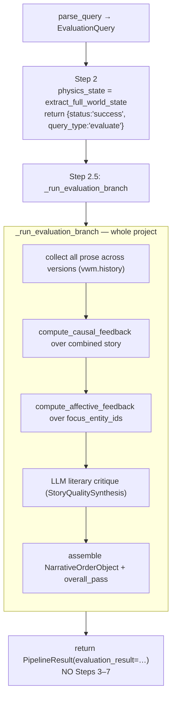

# Query Types, Natural-Language Parsing, and the Cycle

This document explains:

1. The **eight query types** Shadow-Loom understands.
2. How a free-form natural-language request becomes a typed `UserRequest`
   via [`shadow_loom/query_parsing.py`](../shadow_loom/query_parsing.py).
3. How each query type is **realised** end-to-end across one full pipeline
   cycle — what gets touched in the graph, what gets returned, and what gets
   committed.

For the static schema reference, see
[architecture.md §1](architecture.md). For the cycle as code, see
[pipeline-walkthrough.md](pipeline-walkthrough.md). For the academic
provenance, see
[academic-foundations.md §2.1 (Pearl's three rungs)](academic-foundations.md#21-three-rungs-of-causation-observationquery-interventionquery-counterfactualquery),
[§2.2 (AMWN / ctf-calculus)](academic-foundations.md#22-ancestral-multi-world-networks-and-ctf-calculus--correa--bareinboim-icml-2025),
[§3.1 (Wilmot suspense)](academic-foundations.md#31-suspense-as-hopefear-here-hopethreat-anticipation--structural-affect-lineage),
and [§3.4 (dramatic irony)](academic-foundations.md#34-dramatic-irony-as-epistemic-asymmetry).

---

## 1. The eight query types

All queries are Pydantic models in
[`shadow_loom/query_models.py`](../shadow_loom/query_models.py) and share a
`_QueryBase` carrying the user's verbatim `original_query` so the directive
assembler, generator, auditor, and version row can show "what the user
asked for".

| # | Type | Pearl rung | Mutates world? | Writes prose? | Writes version? |
|---|---|---|---|---|---|
| 1 | `ObservationQuery` | 1 | yes | yes | yes |
| 2 | `InterventionQuery` | 2 | yes | yes | yes |
| 3 | `CounterfactualQuery` | 3 | yes (sandbox-rooted) | yes | yes |
| 4 | `DirectiveQuery` | — | yes | yes | yes |
| 5 | `InterrogationQuery` | — | no | no | no |
| 6 | `GeneralQuery` | — | no | no | no |
| 7 | `ManualEditQuery` | — | yes | (user-supplied) | yes |
| 8 | `EvaluationQuery` | — | no | no | no |

### 1. `ObservationQuery` — Rung 1, "natural progression"

```python
class ObservationQuery:
    observations: Dict[str, str]      # {'OBJ_CUP': 'empty', 'ENT_GUARD': 'asleep'}
    focus_entity_ids: List[str]       # POVs to lock onto
```

Conditions the engine on present-tense observed facts and asks "what happens
next?" without applying a `do(·)` operator.

### 2. `InterventionQuery` — Rung 2, "do-operator"

```python
class InterventionQuery:
    interventions: Dict[str, Any]     # {'ENT_MACBETH.location': 'LOC_CHAMBER',
                                      #  'EVT_NEW.spawn': {...}}
    target_node_ids: List[str]        # optional Y-set for ctf-calculus Rule 3
    force_implausible: bool
```

Forces variables to specific states **simultaneously**, severs incoming
causal edges, and propagates forward. Genesis spawns are signalled by the
`.spawn` suffix on the key.

*Channel and utterance interventions* are first-class: the parser accepts
intervention keys like `CHN_RAVEN.intelligibility`,
`CHN_RAVEN.participant_ids`, or `EVT_PROPHECY.truth_value`, and accepts
`channel_ids` / `utterance_event_ids` lists. So
`{"CHN_RAVEN.intelligibility": {"ENT_LADY_M": 0.0}}` cuts Lady Macbeth out
of the raven channel, and `{"EVT_PROPHECY.via_channel_id": null}` removes
the witches’ broadcast altogether — with belief-provenance pruning in the
causal physics engine cleaning up any beliefs whose
`acquired_via_channel_id` referenced the severed channel.

Worked examples from the bundled fixtures:

* `{"CHN_HIDDEN_TELESCREEN_SURVEILLANCE.intelligibility":
  {"ENT_WINSTON": 1.0, "ENT_JULIA": 1.0}}` — promotes both protagonists
  to full decoding of the surveillance channel; the dramatic-irony score
  collapses and the third-act betrayal loses its surprise envelope.
* `{"EVT_UTT_AMY_KIDNAP_STATEMENT.truth_value": "true"}` — flips the
  diary fabrication from `false` to `true`; abduction over
  `CHN_DETECTIVE_PARTNERSHIP` is now allowed to reinforce the kidnap
  hypothesis, and the trial-by-media branch realises canonically.
* `{"CHN_PIP_BENEFACTOR_PIPELINE.intelligibility": {"ENT_PIP": 1.0}}`
  — lets Pip read the channel his great expectations ride on; every
  belief whose `acquired_via_channel_id` cites this pipeline is
  re-derived with the correct provenance.

*Spatial relocation of an event* is a typed do-target on the same
do-operator surface. A `DoEvent` with `new_at_location_id="LOC_X"`
rewrites the event's `at_location_id` and cascades an
`EntityStateSnapshot(location_id="LOC_X")` for every bound (non-channel)
participant at `evt.fabula_time`, so re-extraction sees a coherent
relocation rather than a spatial inconsistency. Channel-mediated
addressees are exempt from the cascade — they reach the event through
`via_channel_id` from wherever they already are. See
[design-decisions.md §D22](design-decisions.md#d22-events-have-an-explicit-spatial-anchor-eventnodeat_location_id).

Under the default `PipelineConfig.branch_policy="auto"`, a `do(X)`
intervention launched from the **factual mainline** auto-forks to a fresh
**shadow** branch (`world_id="shadow"`) — surgical "what changes if X"
probes never mutate canon. When the active head is *already* a shadow
branch, chained interventions stay on that fork rather than spawning a
sibling, so a scenario iterates in place. A mainline intervention is still
available explicitly via `branch_policy="mainline"`. See
[`pipeline.py::_resolve_branch_policy`](../shadow_loom/pipeline.py).

### 3. `CounterfactualQuery` — Rung 3, "abduction + intervention"

```python
class CounterfactualQuery:
    historical_interventions: Dict[str, Any]   # the PAST events to change
    evidence_node_ids: List[str]               # present facts to condition on
    target_node_ids: List[str]
    force_implausible: bool
```

Goes back in time, abducts hidden variables from present-day evidence,
applies the historical interventions, then re-propagates forward.

Under the default `PipelineConfig.branch_policy="auto"`, counterfactual
results are persisted on a fresh **shadow** branch (`world_id="shadow"`)
rather than overwriting factual canon. The MCP `list_branches` /
`promote_branch` tools and the UI version-sidebar Promote-to-canon button
govern when (or whether) the shadow becomes mainline. Historical targets
can name channel and utterance ids the same way as intervention keys, so
“what if Macbeth never told Lady Macbeth about the prophecy” resolves to a
historical removal of the relevant `EVT_*` (or `CHN_*`) without needing to
fabricate an entity-level surrogate. Two more from the bundled corpus:

* *“What if Friar John reached Romeo with the letter?”* —
  `historical_interventions = {"EVT_UTT_BALTHASAR_REPORTS_JULIETS_DEATH":
  ⊘, "EVT_UTT_FRIAR_PLAN_LETTER.delivered": true}`. Belief-provenance
  pruning drops Romeo's `Belief(target=ENT_JULIET, perceived_state="dead",
  acquired_via_event_id="EVT_UTT_BALTHASAR_…")` and the suicide chain
  short-circuits.
* *“What if the great expectations were Magwitch's all along, and Pip
  knew it?”* — sever `CHN_PIP_BENEFACTOR_PIPELINE` before Jaggers'
  announcement event by listing the pipeline channel id in
  `historical_interventions`; Pip's snobbery arc never accumulates and
  the gentleman-trait timeline flattens.

### 4. `DirectiveQuery` — affective optimisation

```python
class DirectiveQuery:
    target_entity_ids: List[str]
    target_effect: Literal["mystery","dramatic_irony","suspense","surprise",
                           "grief","rage","joy","regret","love","fear",
                           "narrative_tension"]
    target_vector_id: Optional[str]
    intensity: float                  # 0.0–1.0
    force_implausible: bool
```

Tells the engine to mathematically optimise the next event to maximise a
specific psychological / epistemic effect. Builds a `CreativeBrief` in
Step 2 by enumerating candidate interventions, scoring each with the
affective calculus, and wrapping the winner in typed `ConstraintBlock`s.

`target_vector_id` accepts a dotted path (e.g. `ENT_MACBETH.traits.guilt`)
so the directive can target a specific sub-axis on a node, not just the
node itself. The validator only checks the **base node id** before the
first dot \u2014 the engine resolves the rest of the path at execution time
because `traits` / `beliefs` / `properties` are arbitrary keyed maps and
the legal sub-keys are content-defined per project.

### 5. `InterrogationQuery` — graph RAG with proof

```python
class InterrogationQuery:
    question: str
    require_proof: bool = True        # return Causal Bridges as proof
```

Pure pathfinding over the AMWN — does **not** advance time and does **not**
write prose. Used for "Is there a physical path …", "Who knows X?",
"What licenses event Y?".

### 6. `GeneralQuery` — full-graph Q&A

```python
class GeneralQuery:
    question: str
    include_topology: bool = True
```

Open-ended omniscient question. Returns the full extracted world state so an
LLM downstream can reason freely. Like `interrogate` it does not advance
time or write prose.

### 7. `ManualEditQuery` — user-authored prose

```python
class ManualEditQuery:
    edited_prose: str
    description: str
    focus_entity_ids: List[str]
```

The user **supplies** the prose. The engine skips physics simulation and
LLM rendering, treats the user's text as ground truth, runs prose →
topology re-extraction, and merges the delta into the world model.

### 8. `EvaluationQuery` — full-story scorecard

```python
class EvaluationQuery:
    focus_entity_ids: List[str]
    include_full_prose: bool
```

Collects all prose across versions, recomputes engine metrics, and produces
a `NarrativeOrderObject` (causal physics feedback + affective feedback +
LLM literary critique + `overall_pass`).

---

## 2. Natural-language → typed query

The MCP `narrate(...)` tool, the UI's chat box, and the CLI all funnel
natural-language requests through
[`shadow_loom/query_parsing.py::parse_query`](../shadow_loom/query_parsing.py).

```python
def parse_query(
    natural_language: str,
    *,
    query_type: Optional[str] = None,        # pin the type, skip classification
    world_state: Optional[WorldStateV1] = None,
    config: Optional[QueryParsingConfig] = None,
) -> QueryParseResult
```

### 2.1 The classification agent

A PydanticAI `Agent` runs with low temperature (0.1) and a
`PromptedOutput(...)` schema. The schema is `ParsedQuery` — a flat record
with one field per query-type-specific parameter:

```python
class ParsedQuery(BaseModel):
    query_type: Literal["observation","intervention","counterfactual",
                        "directive","interrogate","general",
                        "manual_edit","evaluate"]
    reasoning: str

    # observation
    observations: Optional[Dict[str, str]]
    focus_entity_ids: Optional[List[str]]

    # intervention
    interventions: Optional[Dict[str, Any]]

    # counterfactual
    historical_interventions: Optional[Dict[str, Any]]
    evidence_node_ids: Optional[List[str]]

    # shared
    target_node_ids: Optional[List[str]]

    # directive
    target_entity_ids: Optional[List[str]]
    target_effect: Optional[Literal[...]]
    target_vector_id: Optional[str]
    intensity: Optional[float]

    # ...interrogate / general / manual_edit / evaluate fields...

    resolved_ids: List[ResolvedID]   # natural_name → graph ID, with confidence
```

`PromptedOutput` is used (instead of native `format=`) because Ollama
rejects `anyOf` schemas in `format` — this way the schema is injected into
the prompt and validated by Pydantic in Python, so any backend works.

### 2.2 ID grounding via dynamic `Literal` types

When the caller passes a `world_state`, the parser **dynamically rebuilds**
the `ParsedQuery` schema using `pydantic.create_model(...)` so that every
ID-bearing field is constrained to a `Literal[<valid IDs>]` enum:

* `interventions` keys → `Literal[<all node.property combinations>]`
* `evidence_node_ids` → `Literal[<all event IDs>]`
* `target_entity_ids` → `Literal[<all entity IDs>]`
* `target_vector_id` → `Literal[<trait IDs>] | None`
* …and so on.

This forces the LLM to emit **only IDs that exist in the graph** —
hallucinated `ENT_GHOST` IDs simply cannot be encoded in the response.

A compact `_build_graph_summary(world_state)` is also injected into the
user message — for each entity it lists name, status, location, and trait
values so the LLM can pick the right ID by description, not just name.

### 2.3 Fixed-type fast path

When the caller already knows the type (e.g. MCP's `narrate(mode="intervene",
…)`), passing `query_type=` skips classification — the agent is told the
type up-front and only needs to fill in the type-specific fields. This is
both faster and safer.

### 2.4 Output validation + fallbacks

After the LLM returns, `_attach_output_validator` runs Pydantic validation
plus structural checks (e.g. an intervention query must have non-empty
`interventions`). On failure, two fallbacks try in order:

1. **Fuzzy ID resolution** — close-but-wrong IDs are repaired via
   `difflib.SequenceMatcher` against the world model's ID set; the
   remappings are recorded in `FallbackInfo.id_remappings`.
2. **General-query fallback** — if the request can't be resolved as the
   chosen type, it's downgraded to a `GeneralQuery` so the user still gets
   an answer (with `FallbackInfo.strategy = "general_fallback"`).

The result is a `QueryParseResult`:

```python
QueryParseResult(
    query: Optional[UserRequest],          # the constructed query, ready for run_pipeline
    parsed: Optional[ParsedQuery],         # the raw LLM classification
    validation_errors: List[ValidationError],
    is_valid: bool,
    fallback: Optional[FallbackInfo],
)
```

`narrate` surfaces `parsed.reasoning` and `resolved_ids` back to the MCP
client so the agent can show its work.

---

## 3. How each query type is realised in a cycle

The orchestrator is `run_pipeline` (see
[pipeline-walkthrough.md](pipeline-walkthrough.md)). Step 2 routes by
`query.query_type` inside
[`narrative_physics.py::calculate_narrative_physics`](../shadow_loom/narrative_physics.py).
Below is the **per-type realisation** — what actually happens in the engine.

### 3.1 Observation cycle (Rung 1)



The Observation cycle is the simplest "advance the clock" path — no
do-operator, no abduction, but full audit and re-extraction so the world
model picks up the new prose.

### 3.2 Intervention cycle (Rung 2)



The Intervention cycle is where do-calculus actually runs. The two
plausibility tiers (target resolution → engine vacuity) ensure the world
model is **never** mutated by a request that had no effect.

### 3.3 Counterfactual cycle (Rung 3)



The result includes `hidden_deltas` — the latent variable updates abduction
discovered. These are surfaced in the brief so the renderer can dramatise
"what the present-day evidence retroactively reveals about the past".

> **Engine results are Monte-Carlo by default — but stable.** With
> `monte_carlo_samples > 0` (default **24**) every `engine.execute()` call —
> Rung 2 and Rung 3 — auto-routes through `execute_distribution`, perturbing
> `causal_force ~ Normal(force, sigma(evidence_strength))` and trait values
> `~ Beta`. The engine therefore returns a *distribution* (mean / p5 / p50 /
> p95) over post-propagation traits rather than a single brittle point
> estimate. Because `monte_carlo_seed` defaults to a **fixed int (0)**, the
> sampler is reproducible: the same world + query always draws the same
> sample sequence, so both the distribution and the downstream tier-2
> vacuity / plausibility verdict are **stable run-to-run**. Set
> `monte_carlo_seed = None` for unseeded, genuinely stochastic sampling
> (e.g. to study verdict sensitivity near a decision boundary); set
> `monte_carlo_samples = 0` to fall back to a deterministic point-estimate
> `execute()` with no distribution. See [settings.md](settings.md)
> `monte_carlo_*`.

### 3.4 Directive cycle (affective optimisation)



The optimiser ranks on the **cumulative** surprise form; the
Itti-Baldi local form `KL(q_s || q_{s-1})` is what the time-series
chart plots. The positive and inverse emotion indicators share the
`_EFFECT_TRAITS` table.

The brief is the **only** thing the renderer LLM sees. The renderer cannot
invent causal edges or shift entity state — its job is to dramatise the
mathematical envelope.

### 3.5 Interrogate cycle (graph RAG + LLM answer)



The pipeline early-returns after the answer step. No prose is rendered
and no `VersionRow` is created — the result is consumed directly by the
MCP `ask` tool and by the UI's **Answer panel**. When `require_proof=true`
the `evidence_node_ids` list (plus the `proof` array) lets the consumer
walk `physics_state.causal_topology` to construct the Causal Bridge that
backs the answer.

### 3.6 General cycle (full-graph Q&A + LLM answer)



Same shape as `interrogate` but the omniscient state (including topology
unless the caller turns it off) is the context the LLM answers from.

### 3.7 Manual-edit cycle



This is the surface that lets a user **author directly into the world
model**. It bypasses physics and LLM rendering, but it still goes through
prose → topology re-extraction so the world model stays in sync with the
new prose. The MCP `write` tool is the canonical entry point.

### 3.8 Evaluate cycle



`evaluate` is the only query type that operates on the **whole project
history** rather than a single tip. It does not write a version because it
doesn't change the story — it grades it.

---

## 4. Closing the cycle — versioning at the boundary

Every cycle that produces a prose-mutating result returns a `PipelineResult`
with a fresh `world_model` (the `VersionedWorldModel` after the Step 7
merge). The pipeline itself **does not write to the database**; the caller
does:

* MCP `narrate` / `direct` / `write` / `ingest` route through
  `shadow_loom_mcp/helpers.py::run_and_save`, which
  `save_version(...)` + `set_active_version(...)` in one transaction —
  but only when `result.implausible` is False **and**
  `result.reextraction_failed` is False.
* The UI's task helpers do the same.

This is the discipline that keeps the version tree clean: a query that the
engine refused to apply (implausible) and a query whose prose couldn't be
re-extracted into topology (re-extraction failed) **never become canonical
versions**. The user sees the explanation or the draft prose, but the
graph is unchanged.

---

## See also

* [pipeline-walkthrough.md](pipeline-walkthrough.md) — the surrounding pipeline (Steps 0, 1, 3–7) the per-type Step 2 routes described here drop into.
* [architecture.md §2 (Director intent)](architecture.md) and [§3 (causal physics)](architecture.md) — the conceptual map of the eight types and the engine they drive.
* [mcp-guide.md §3 (CREATE)](mcp-guide.md) — `narrate`, `direct`, `write`, `ingest` — the agent-facing surface that builds these queries.
* [ui-guide.md](ui-guide.md) — the **Story** and **Reasoning** tabs where users issue these queries interactively.
* [academic-foundations.md](academic-foundations.md) — Pearl's three rungs ([§2.1](academic-foundations.md#21-three-rungs-of-causation-observationquery-interventionquery-counterfactualquery)) mapped to observation/intervention/counterfactual; AMWN sandboxing ([§2.2](academic-foundations.md#22-ancestral-multi-world-networks-and-ctf-calculus--correa--bareinboim-icml-2025)); Wilmot suspense ([§3.1](academic-foundations.md#31-suspense-as-hopefear-here-hopethreat-anticipation--structural-affect-lineage)); KL surprise ([§3.3](academic-foundations.md#33-surprise-as-kl-divergence)); Halpern actual causality ([§2.3](academic-foundations.md#23-abduction-causalphysicsengineabduction_update)).
* [settings.md](settings.md) — runtime knobs that control parsing retries, intervention defaults, and the audit thresholds the cycle is checked against.
